# run

## prometheus & redis

```
docker-compose up
```

## frontend

```
cd frontend
npm install
npm start
```

## backend

```
cd backend
npm install
npm run develop
```

# Techs

- strapi V4 (CMS Nov 29, 2021)
- prometheus
- redis
- sentry
- docker-compose
- react
- antd
- material

# features

## backend

- strapi v4
- prometheus
- redis
- sentry

### strapi v4 panel


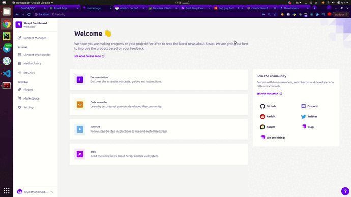

### redis cache for get requests

without cache:


with cache:


### prometheus


```http://localhost:9090/graph?g0.range_input=1h&g0.expr=s200&g0.tab=0&g1.range_input=1h&g1.moment_input=2022-02-12%2014%3A34%3A01&g1.expr=s403&g1.tab=0&g2.range_input=1h&g2.expr=s500&g2.tab=0&g3.range_input=1h&g3.expr=cnt_reqouests&g3.tab=0&g4.range_input=1h&g4.expr=total_requests_time&g4.tab=0```


### sentry (plugin)


## frontend

### search


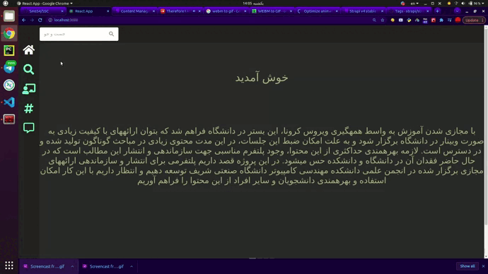

### search by tag, writer or blog


### filter by tag


### find blogs of tag

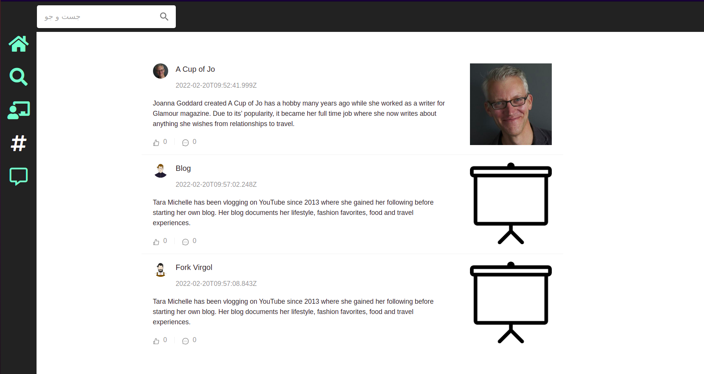

### writers profile

- timeline of blogs
- name, bio and ...
- avatar


### show blog

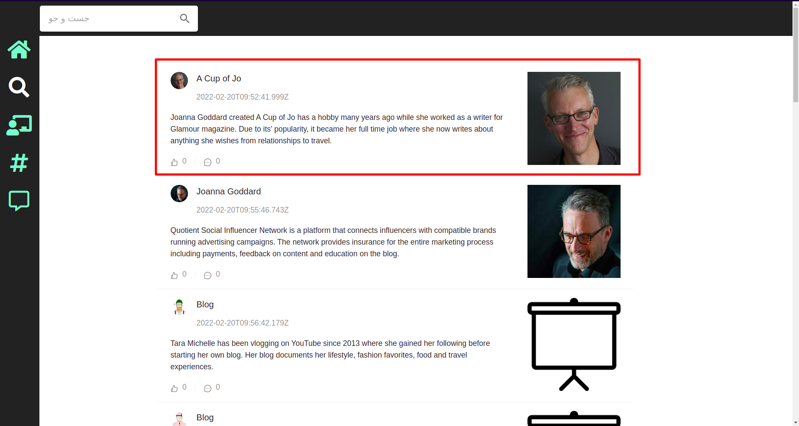
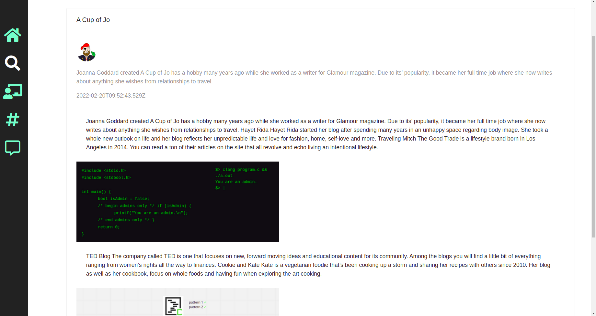

## home

slide show

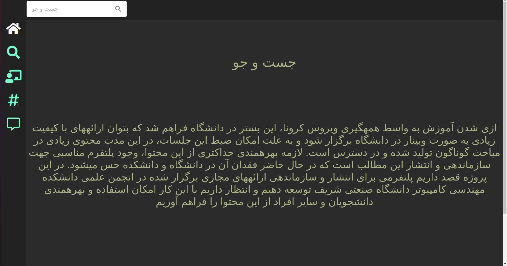

## clean code

### modules

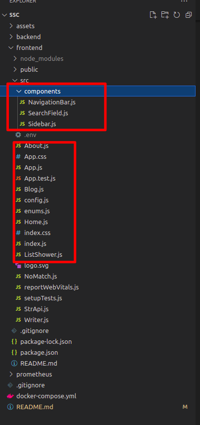

### Router

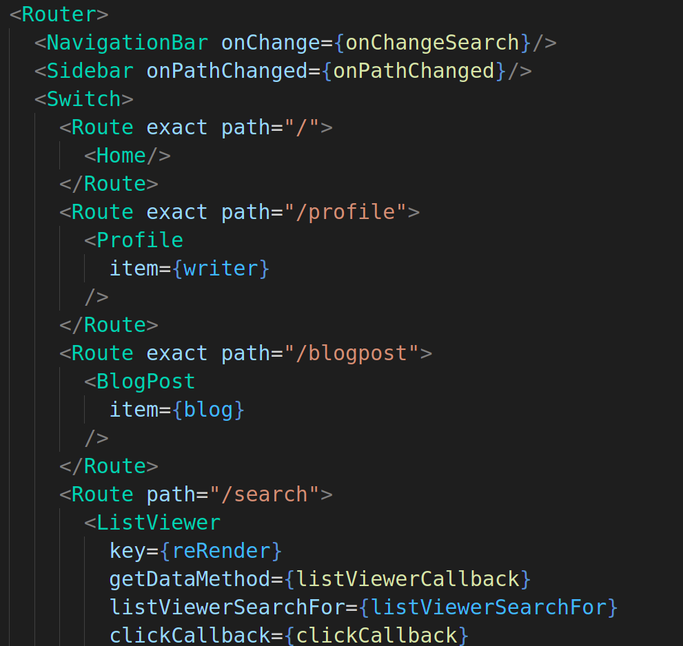

## security

### permissions

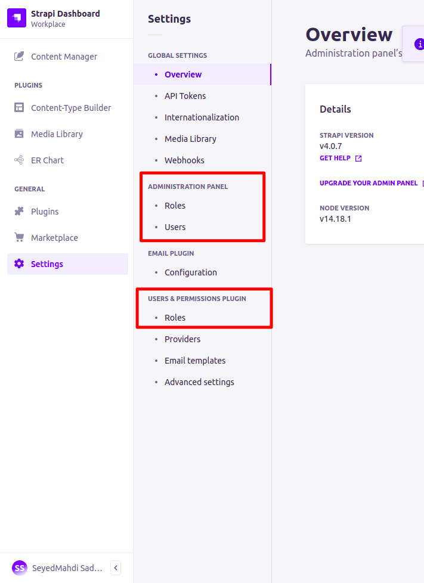
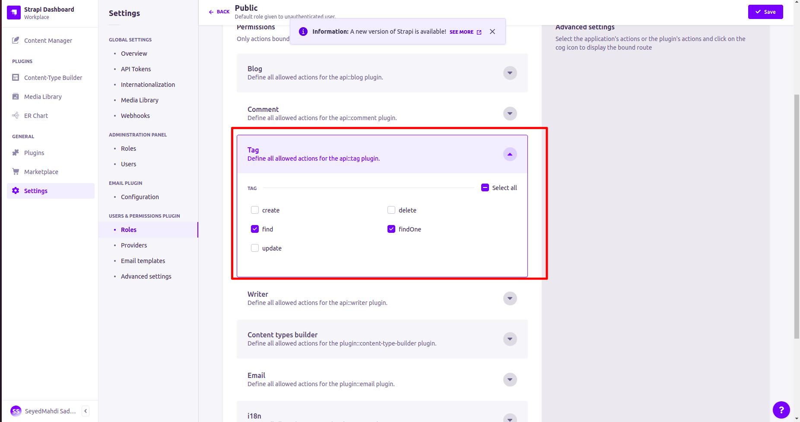

### .env

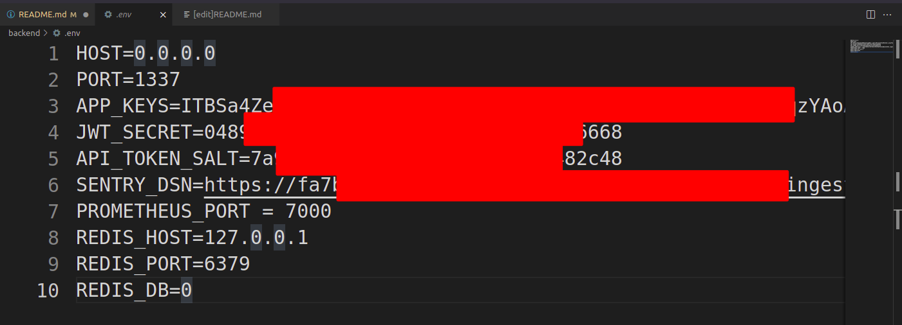
